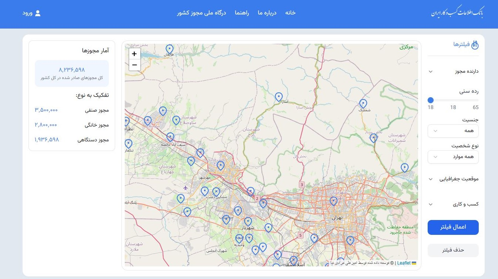
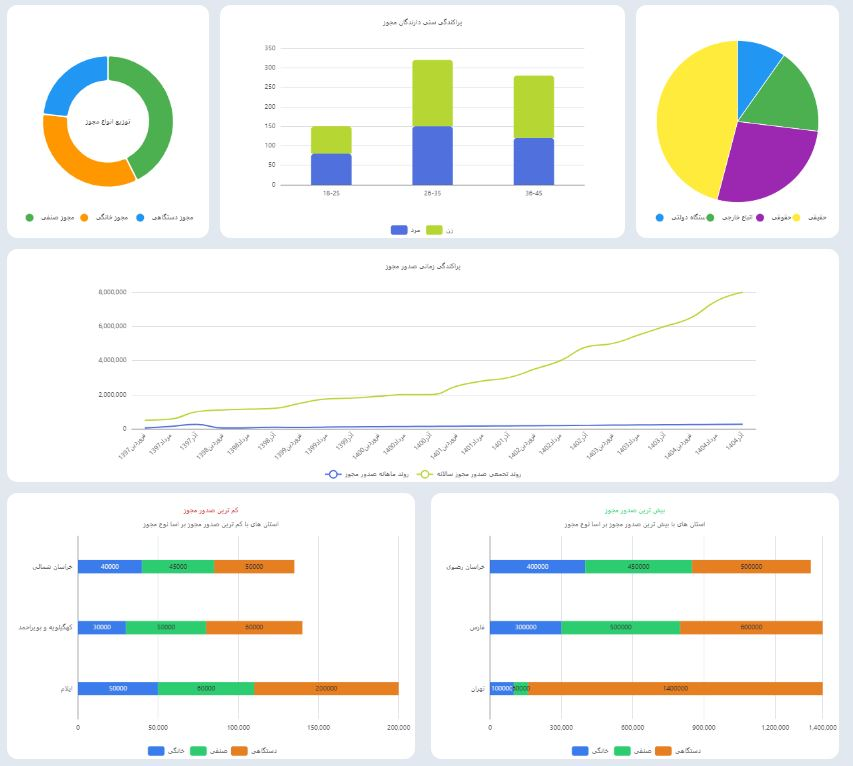

# Refactor Mojavez

## Overview

Refactor Mojavez is a modern web application built with Next.js and React, featuring interactive maps using Leaflet, data visualization with ECharts, and a fully responsive layout. The project leverages Shadcn UI for reusable, accessible components and Tailwind CSS for styling.




## 🛠 Technologies Used

This project is built using the following technologies:

- **Next.js 16.0.3** – React framework for server-side rendering and routing
- **React 19.2** & **React DOM 19.2** – Core UI library
- **React Hook Form 7.66.1** & **@hookform/resolvers 5.2.2** – Form handling and validation
- **Leaflet 1.9.4** & **React Leaflet 5.0.0** – Interactive maps and map components
- **Tailwind CSS 4** & **tw-animate-css 1.4.0** – Utility-first styling and animations
- **Shadcn UI** – Component library built on Radix UI and Tailwind CSS
- **Radix UI** – Accessible UI primitives: Accordion, Label, Select, Separator, Slider, Slot
- **ECharts 6.0.0** & **echarts-for-react 3.0.5** – Data visualization / charts
- **Lucide React 0.554.0** – Icons library
- **Zod 4.1.12** – Schema validation for forms and data
- **clsx 2.1.1** & **class-variance-authority 0.7.1** – Conditional and variant-based class handling
- **React Multi Date Picker 4.5.2** – Date picking component

## Features

- Interactive maps of Iran with cities markers and GeoJSON support.
- Full responsive design for mobile, tablet, and desktop screens.
- Dynamic filtering and summary sections integrated with the map.
- Charts and data visualization using ECharts.
- Form validation and handling with React Hook Form and Zod.
- Custom UI components using Shadcn UI and Radix UI primitives.
- Tailwind CSS animations and utility classes for fast styling.

## Installation

```

## Usage

- Visit `http://localhost:3000` to view the application.
- Use the interactive map to explore different cities.
- Filter data and view summaries through the responsive interface.

## License

MIT License
```
